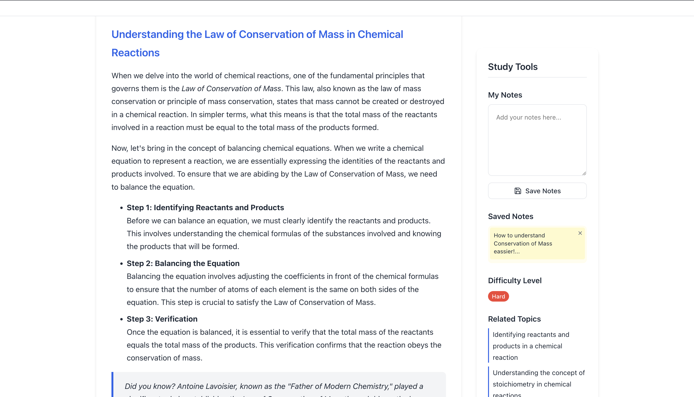
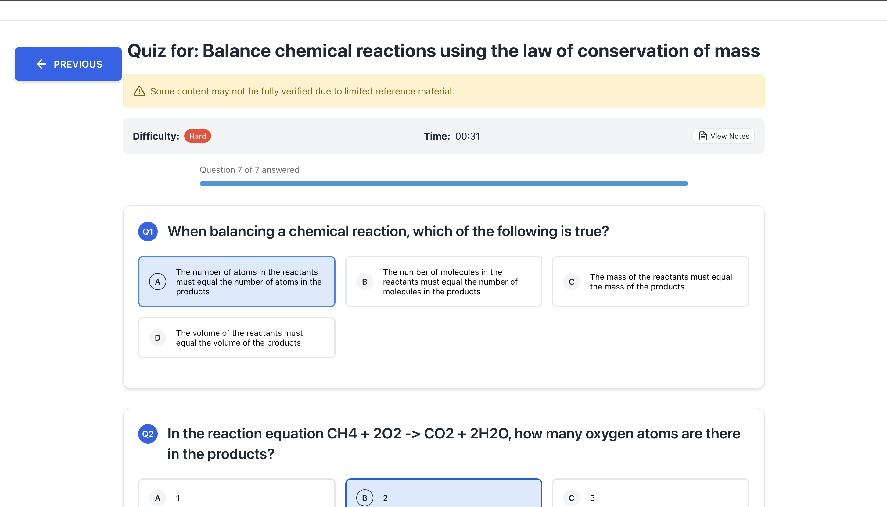

# Educational Quiz Generator


A modern web application that generates educational content and interactive quizzes based on learning objectives using LLM technology enhanced with Retrieval-Augmented Generation (RAG).

## 📋 Table of Contents

- [Project Overview](#project-overview)
- [Features](#features)
- [Screenshots](#screenshots)
- [Technical Architecture](#technical-architecture)
- [Getting Started](#getting-started)
- [Textbooks](#textbooks)
- [Deployment](#deployment)
- [Code Structure](#code-structure)
- [Development Decisions](#development-decisions)
- [Future Improvements](#future-improvements)
- [Author](#author)

## 🔍 Project Overview

This application integrates a React frontend with a FastAPI backend to create an educational tool that:

1. Takes a learning objective as input
2. Generates a theoretical summary of the topic
3. Creates multiple-choice quiz questions to test understanding
4. Grades user responses and provides feedback

## ✨ Features

- **Learning Objective Input**: Users can type their own learning objective or select from suggested topics
- **Dynamic Content Generation**: Educational content is generated on demand using AI
- **Scientific Verification**: Content is verified against textbook sources using RAG technology
- **Interactive Quiz**: Multiple-choice questions with immediate feedback
- **Responsive Design**: Works on desktop and mobile devices
- **Navigation**: Intuitive flow between application states
- **Error Handling**: Clear feedback for failed API requests or validation issues
- **Quality Indicators**: Transparent warnings when content can't be fully verified with scientific sources

## 📸 Screenshots

### Learning Objective Selection


*Select your learning objective and difficulty level.*

### AI-Generated Educational Content


*Learn the theory with AI-generated educational content and take notes.*

### Interactive Quiz


*Test your knowledge with multiple-choice questions on the topic.*

### Results and Feedback


*See your score and review your performance.*

## 🏗️ Technical Architecture

The application uses a Retrieval-Augmented Generation (RAG) system to ensure scientific accuracy:

- **Vector Database**: Stores embeddings of OpenStax textbook content
- **Retrieval System**: Finds relevant scientific content for each query
- **Enhanced Prompts**: Augments LLM prompts with verified scientific information
- **Verification Logic**: Assesses confidence in scientific accuracy of responses

The application leverages OpenAI's GPT models combined with the RAG system to generate high-quality, scientifically accurate educational content and quiz questions.

## 🚀 Getting Started

### Prerequisites

- Node.js (v16+)
- Python (v3.9+)
- An OpenAI API key
- Conda (for installing FAISS)

### Setup

1. Clone the repository:

   ```bash
   git clone https://github.com/JuanNavarr0/educational-quiz-generator.git
   cd educational-quiz-generator
   ```

2. Create a virtual environment in the root directory:

   ```bash
   python -m venv venv
   ```

3. Activate the virtual environment:

   - Windows: `venv\Scripts\activate`
   - macOS/Linux: `source venv/bin/activate`

4. Install dependencies:

   ```bash
   pip install -r requirements.txt
   ```

5. Install FAISS using Conda (important, as it may not install correctly via pip):

   ```bash
   conda install -c pytorch faiss-cpu
   ```

6. Create a `.env` file in the root directory with your OpenAI API key:

   ```
   OPENAI_API_KEY=your_api_key_here
   ```

7. Set up the frontend:

   ```bash
   cd frontend
   npm install
   cd ..
   ```

8. Start the application:

   - In one terminal window (from the root directory), start the server:
     ```bash
     uvicorn app.main:app --reload
     ```
   - In another terminal window (from the frontend directory):
     ```bash
     cd frontend
     npm run dev
     ```

9. Access the application at `http://localhost:5173`

## 📚 Textbooks

This project uses OpenStax textbooks for the RAG system. Download these textbooks and place them in the `textbooks/` directory before running the application:

- [University Physics Vol 1](https://openstax.org/details/books/university-physics-volume-1)
- [University Physics Vol 2](https://openstax.org/details/books/university-physics-volume-2)
- [Biology 2e](https://openstax.org/details/books/biology-2e)
- [Chemistry 2e](https://openstax.org/details/books/chemistry-2e)
- [Anatomy and Physiology](https://openstax.org/details/books/anatomy-and-physiology-2e)
- [Organic Chemistry](https://openstax.org/details/books/organic-chemistry)
- [Microbiology](https://openstax.org/details/books/microbiology)

## 🌐 Deployment

### Backend Deployment

The FastAPI application can be deployed to various cloud platforms:

**Heroku**:

1. Create a Procfile with: `web: uvicorn app.main:app --host=0.0.0.0 --port=${PORT:-5000}`
2. Set environment variables in the Heroku dashboard
3. Deploy using the Heroku CLI or GitHub integration

**AWS (using Elastic Beanstalk)**:

1. Create an Elastic Beanstalk environment with the Python platform
2. Configure environment variables for the OpenAI API key
3. Deploy using the EB CLI or AWS console

### Frontend Deployment

The React application can be deployed to:

**Vercel/Netlify**:

1. Connect your GitHub repository
2. Set the build command to `npm run build`
3. Configure environment variables if needed

**AWS S3 + CloudFront**:

1. Build the application: `npm run build`
2. Upload the build directory to an S3 bucket
3. Configure CloudFront for distribution

## 📁 Code Structure

### Backend Files

- `main.py` - Application entry point and FastAPI configuration
- `app/api/quiz_endpoints.py` - Quiz generation endpoint with scientific verification
- `app/api/theory_endpoints.py` - Theory generation endpoint with scientific verification
- `app/core/openai_client.py` - OpenAI API integration with RAG enhancement
- `app/core/rag_system.py` - Core RAG implementation for scientific verification
- `app/models/quiz_models.py` - Pydantic models for request/response validation
- `app/models/rag_models.py` - Pydantic models for the RAG system
- `app/utils/document_processor.py` - Utilities for processing textbook content
- `scripts/process_textbooks.py` - Script to process textbooks and build the vector database

### Frontend Files

- `frontend/src/main.jsx` - React application entry point
- `frontend/src/App.jsx` - Main application component with state management
- `frontend/src/App.css` - Styling with responsive design

## 🧠 Development Decisions

1. **UI/UX Design**:

   - Clean, minimalist design focused on content
   - Step-by-step flow for better user experience
   - Visual feedback for quiz answers
   - Transparent warning indicators for scientific verification

2. **API Structure**:

   - Separated theory and quiz endpoints for modularity
   - Used Pydantic models for request validation
   - Implemented error handling for robust operation
   - Enhanced responses with scientific verification metadata

3. **State Management**:

   - Used React's useState for application state
   - Clear separation of UI states (input, theory, quiz)
   - Manageable data flow between components

4. **Scientific Verification**:
   - Used sentence-transformers for local embedding to reduce API costs
   - Implemented FAISS for efficient vector search
   - Developed a confidence scoring system to determine when warnings are needed
   - Enhanced LLM prompts with relevant scientific content from textbooks

## 🔮 Future Improvements

1. **Enhanced Error Recovery**:

   - Implement retry mechanisms for API failures
   - Add more detailed error messages

2. **UI Enhancements**:

   - Animations for transitions between screens
   - Progress indicators for quiz completion
   - More detailed feedback for quiz results

3. **Performance Optimizations**:

   - Implement caching for generated content
   - Optimize API calls for faster response times

4. **Additional Features**:
   - Support for different question types (not just multiple choice)
   - Save/export functionality for generated content
   - User accounts to track learning progress

## 👨‍💻 Author

Juan Navarro Muñoz

---

<p align="center">
  Made with ❤️ for education
</p>
